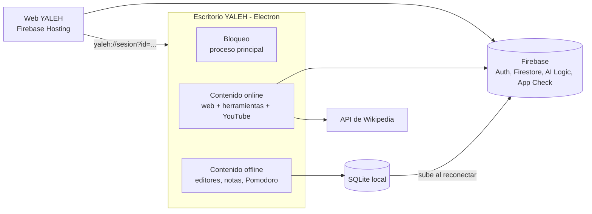

# Brief — YALEH v1

> Especificación de la versión 1. Autor: Mario Víctor Brañez Rodriguez (TECBA, Cochabamba).
> Fecha: 28 de septiembre de 2026. **Revisión 1.3** (28/09/2026): detección del modo, pantallas de inicio del escritorio, esquema SQLite y URL del Moodle. La revisión 1.2 eliminó la salida de emergencia; la 1.1 incorporó las decisiones del plan de trabajo (sección 16).
> Documento complementario: `INFORME_ANALISIS_SRB.md` (análisis del MVP actual).
> El diseño visual se define **después**; en esta versión no se rediseña la interfaz.
> Este documento es la **fuente de verdad** del proyecto: si el código lo contradice, gana el brief.

---

## 1. Qué es YALEH

YALEH es un entorno de estudio para estudiantes del TECBA con problemas de concentración. Tiene dos aplicaciones:

- **Web:** el centro de trabajo con IA. El estudiante inicia sesión, carga sus materiales, trabaja con el asistente y prepara su sesión de concentración.
- **Escritorio (Electron):** bloquea el sistema operativo durante la sesión, al estilo de Safe Exam Browser. Funciona con o sin internet.

No hay navegación libre por internet. La información la busca el asistente de IA, y el estudiante solo accede a herramientas autorizadas: Google Workspace, Canva, Gamma, Moodle y Classroom.

El proyecto parte del MVP existente ("Safe Research Browser"), que se **reorganiza**, no se rehace.

---

## 2. Decisiones cerradas

| Tema | Decisión |
| --- | --- |
| Productos | Dos aplicaciones en v1: web y escritorio |
| Función principal del escritorio | Bloquear el sistema operativo durante la sesión, con o sin conexión |
| Modo | Lo define el inicio: con sesión de Google es online; sin conexión es offline. El escritorio detecta la conexión en el proceso principal: online si `net.isOnline()` es verdadero y la web de YALEH responde una petición HTTPS en menos de 5 segundos (cualquier respuesta HTTP cuenta). Se vuelve a comprobar cada 30 segundos, al volver de la suspensión y con los eventos de red |
| Navegación | Sin navegación libre; la IA busca la información |
| Enciclopedia (Encarta) | Eliminada |
| IA en v1 | Solo en línea: Gemini mediante Firebase AI Logic (API de desarrollador de Gemini, nivel gratuito) |
| Búsqueda de información en v1 | **API pública de Wikipedia en español** (`es.wikipedia.org`); los artículos se pasan a Gemini como contexto. Detrás de una interfaz de proveedor de búsqueda para agregar OpenAlex en v2 (sección 7) |
| Búsqueda con Google | **Fuera de v1** (no está disponible en el nivel gratuito; ver sección 7) |
| App Check | **Obligatorio** para AI Logic desde el 2 de noviembre de 2026. Proveedor: Google Cloud Fraud Defense (antes reCAPTCHA Enterprise) con `ReCaptchaEnterpriseProvider` |
| IA local | v2 |
| Backend | Firebase, plan gratuito **Spark**: Authentication, Firestore, Hosting, AI Logic y App Check. **Sin servidor propio**. Proyecto `Yaleh` (ID `yaleh-fbe1c`) |
| Base de datos local | SQLite en el escritorio, con el módulo integrado `node:sqlite` |
| Runtime | Node.js y Electron |
| Vista principal | Estilo NotebookLM, en tres columnas |
| Mapas mentales | v2 (no olvidar) |
| Ofimática | Editores propios en el escritorio con exportación a `.docx`, `.xlsx` y `.pptx` |
| Google Workspace | Solo en modo online |
| Reproductor de YouTube | Embebido, solo en el escritorio online |
| Salida anticipada | **No existe.** No hay salida de emergencia ni código: la sesión solo termina al cumplirse el tiempo (o apagando o reiniciando el equipo) |
| Duración de la sesión | Entre 1 y **180 minutos** (`shared/config.ts`) |
| Confirmación | Antes de entrar al kiosko, pantalla de confirmación con los archivos cargados, la duración y el aviso de que no se puede salir (sección 4.3) |
| Sesión interrumpida | Si la app se cierra durante una sesión (apagado, reinicio o cierre forzado), al volver a abrirla se registra como interrumpida y, si aún queda tiempo, se ofrece retomarla |
| Nombre | YALEH (reemplaza a "SRB" y "Safe Research Browser" en todo el código y la interfaz) |

---

## 3. Arquitectura general

El escritorio es un **contenedor bloqueado** con dos capas independientes:

1. **Bloqueo:** vive en el proceso principal de Electron y funciona siempre, con o sin red.
2. **Contenido:** cambia según el modo.
   - Online: carga la web de YALEH (Firebase Hosting) dentro del kiosko, más las herramientas en pestañas.
   - Offline: muestra los módulos locales (editores, notas, Pomodoro, archivos).



No hay servidor propio. Firebase AI Logic protege la clave de Gemini, App Check limita el acceso a la app legítima, las reglas de seguridad de Firestore controlan el acceso a los datos y la web se publica en Firebase Hosting.

### Organización del código (aprobada)

**Un solo paquete** (sin monorepo) y **una sola compilación de la interfaz**:

- `src/`: interfaz React compartida por la web y el escritorio. Se compila una vez en `dist/` con `base: './'`; esa misma salida se publica en Firebase Hosting y se incluye en el instalador del escritorio.
- `electron/`: proceso principal y preload en TypeScript, empaquetados con esbuild en `dist-electron/`. El preload se empaqueta como un único archivo CommonJS, requisito de `sandbox: true`.
- `shared/`: módulo de configuración único (modelos de Gemini, proveedor de App Check, sitios permitidos, límites) y tipos de los canales IPC, usado por el proceso principal y la interfaz.

La interfaz detecta la plataforma (`window.electronAPI` presente o no) y el modo (online u offline, informado por el proceso principal) para mostrar u ocultar funciones. Como el escritorio en modo online carga la web publicada, la web comprueba la versión del escritorio (`electronAPI.version`) y avisa si está desactualizado.

Se descartó el monorepo (`apps/web`, `apps/desktop`, `packages/shared`): con un solo desarrollador y casi toda la interfaz compartida, complica electron-builder y la gestión de dependencias sin aportar nada que `shared/` no resuelva.

---

## 4. Flujos de sesión

### 4.1 Sesión online (empieza en la web)

1. El estudiante inicia sesión en la web con Google (Firebase Authentication).
2. Carga sus archivos en la dropzone.
3. Configura el tiempo de concentración (25, 50 o 90 minutos, o manual hasta 180).
4. Confirma la sesión en la pantalla de confirmación (sección 4.3).
5. La sesión se guarda en Firestore y la web abre el escritorio con `yaleh://sesion?id=<id>`.
6. El escritorio **se bloquea en cuanto recibe el enlace** (kiosko activo, sin temporizador todavía) y muestra una pantalla de carga.
7. El escritorio genera un `state` aleatorio y abre el inicio de sesión de Google en el navegador del sistema (sección 4.5). Como el estudiante ya inició sesión en la web, el paso es casi automático.
8. La web cargada en el kiosko inicia sesión, lee la sesión de Firestore y confirma la duración al proceso principal.
9. **El tiempo empieza a contar cuando se confirma la duración.** Antes de ese momento se permite cancelar; después, la sesión solo termina al cumplirse el tiempo.

### 4.2 Sesión offline (empieza en el escritorio)

**El escritorio no tiene login propio:** no existen el login manual ni el acceso como invitado (el login de la web sigue en la web hasta la fase 4). Al abrirse, muestra "Comprobando conexión…" hasta la primera detección y luego:

1. **Sin conexión:** **"No estás conectado. ¿Quieres iniciar sesión offline?"**, con los botones "Iniciar sesión offline" (va a la dropzone) y "Reintentar conexión".
2. El estudiante carga archivos locales en la dropzone.
3. Configura el tiempo.
4. Confirma la sesión en la pantalla de confirmación.
5. Se activa el kiosko con los módulos locales.

**Escritorio abierto con internet sin venir de la web:** muestra **"Inicia tu sesión desde la web"**, con un botón que abre la web de YALEH en el navegador del sistema y otro "Usar modo offline" (mismo flujo offline). Solo sin empaquetar aparece además "Probar sesión online (solo desarrollo)", que permite probar el modo online del kiosko hasta que la fase 4 traiga el flujo real desde la web.

**Kiosko en modo offline:** solo módulos locales (editores, Pomodoro, archivos, historial y estadísticas). Las herramientas online (Workspace, Classroom, Moodle, Canva, Gamma) no se muestran, y el panel de IA muestra "Disponible próximamente".

### 4.3 Durante la sesión (ambos modos)

- El proceso principal cuenta el tiempo. No se puede romper desde la aplicación.
- **No hay salida anticipada.** No existe salida de emergencia ni código: la sesión solo termina al cumplirse el tiempo. La única forma de salir antes es apagar o reiniciar el equipo (o forzar el cierre con Ctrl+Alt+Supr, que Windows no permite bloquear).
- **Confirmación previa.** Antes de entrar al kiosko, una pantalla muestra:
  - Los archivos cargados y la pregunta "¿Cargaste todos los archivos que necesitas?", con la opción de volver a la dropzone.
  - La duración elegida (máximo 180 minutos).
  - El aviso: "No podrás salir hasta que termine el tiempo. Solo apagando o reiniciando el equipo."
  - El estudiante confirma con un botón explícito.
- **Sesión interrumpida.** Al iniciar la sesión, el proceso principal guarda su estado (inicio y `sessionEndsAt`). Si la app se abre y encuentra una sesión activa sin terminar, la registra como "interrumpida" y, si todavía queda tiempo, ofrece retomarla con el tiempo restante (el tiempo sigue corriendo mientras el equipo está apagado).
- **Registro.** Las pérdidas de foco de la ventana y las interrupciones se registran con fecha y hora.
- **Salida para desarrollo.** Solo cuando la app no está empaquetada existe un atajo (Ctrl+Shift+F12) que libera el kiosko y queda registrado. En la versión empaquetada no existe.
- Si se corta internet a mitad de sesión, el kiosko sigue cerrado y el tiempo sigue corriendo. Las herramientas online y la IA se ocultan, aparece el aviso **"Sin conexión: puedes seguir con los módulos locales"** y se registran los eventos `connection-lost` y `connection-restored`. Al volver la conexión, las herramientas reaparecen. **El resto de la sesión se guarda en SQLite con el mismo identificador de sesión y se sube a Firestore al reconectar.**

### 4.4 Al terminar

1. Se cumple el tiempo y se muestra el resumen de la sesión.
2. La sesión se guarda en SQLite.
3. Si hay conexión, se sube a Firestore.
4. Se libera el sistema operativo.

### 4.5 Inicio de sesión dentro del kiosko

Google puede bloquear su inicio de sesión dentro de ventanas de Electron. Por eso **el escritorio nunca muestra el login de Google adentro**:

1. El escritorio abre el inicio de sesión de Google en el **navegador del sistema**. La página de inicio de sesión para el escritorio **se rehace dentro de este repositorio** y se publica en Firebase Hosting (la página del MVP no estaba versionada).
2. La página obtiene el **ID token de Google** con `GoogleAuthProvider.credentialFromResult(result).idToken` (no el ID token de Firebase) y lo devuelve por `yaleh://auth?...`, junto con el `state` aleatorio generado por el escritorio.
3. El escritorio valida el `state` y la web cargada en el kiosko inicia sesión con `signInWithCredential(GoogleAuthProvider.credential(idToken))`.

Este flujo inicia sesión en **Firebase**, no en las páginas de Google: Workspace y Classroom pueden seguir pidiendo su propio inicio de sesión dentro del kiosko (riesgo aceptado, sección 13). Se prueba al inicio de la fase de Firebase.

---

## 5. Aplicación web

La web se usa en el navegador y también dentro del kiosko en modo online. En el navegador **no bloquea nada**: el bloqueo es exclusivo del escritorio.

### 5.1 Flujo de entrada

Inicio de sesión con Google → dropzone → configuración del tiempo → confirmación → iniciar sesión (abre el escritorio).

### 5.2 Vista principal (estilo NotebookLM)

| Columna | Contenido |
| --- | --- |
| Izquierda: **Fuentes** | Archivos cargados en la dropzone |
| Centro: **Chat** | Conversación con el asistente sobre los materiales y búsquedas en Wikipedia |
| Derecha: **Estudio** | Resumen, cuestionario, tarjetas de estudio e informe generados por la IA; recuadro de **notas** |

En pantallas angostas, las columnas se convierten en pestañas. El mapa mental queda para v2.

### 5.3 Sidebar izquierdo (se oculta con un botón)

- **Estadísticas** (dashboard).
- **Pomodoro.**
- **Herramientas:** Google Workspace, Canva, Gamma, Moodle y Classroom. En el navegador se abren en una pestaña nueva del navegador; en el kiosko, en pestañas internas.
- **Actividades recientes:** sesiones pasadas.
- **Configuración:** botón visible; su función se define después.

### 5.4 Otros requisitos

- Mensaje de bienvenida al usuario (solo en la web).
- Pestañas internas para abrir varias vistas a la vez.
- Los enlaces dentro de las respuestas de la IA quedan **bloqueados** por ahora: las fuentes se muestran como texto.

### 5.5 Se elimina de la web

Barra superior completa (buscador y botón de configuración), Enciclopedia SRB, videos educativos, material offline, sección "Task" y ofimática.

---

## 6. Aplicación de escritorio

| Función | Modo online | Modo offline |
| --- | --- | --- |
| Bloqueo del sistema operativo | Sí | Sí |
| Inicio | Recibe la sesión desde la web | "No estás conectado…" → dropzone → tiempo |
| Vista principal | La web de YALEH cargada dentro del kiosko | Misma distribución; el **chat** y las **funciones de IA de la columna de estudio** muestran **"Disponible próximamente"**. Las **notas** funcionan |
| Asistente de IA | Sí (Gemini) | No en v1 |
| Workspace, Canva, Gamma, Moodle, Classroom | Pestañas internas | No visibles |
| Reproductor de YouTube | Sí | No |
| Editores de ofimática | Sí | Sí |
| Notas, archivos y Pomodoro | Sí | Sí |
| Historial | Firestore | SQLite, se sube al reconectar |

### 6.1 Editores de ofimática

Se construyen dentro de la aplicación con librerías web. **No se usa FreeOffice**: es un programa aparte que rompería el aislamiento del kiosko y no se puede incluir en el instalador.

| Editor | Base | Exporta a |
| --- | --- | --- |
| Documento | Editor de texto enriquecido (TipTap), partiendo del editor actual del MVP | `.docx` (librería `docx`) y `.pdf` |
| Hoja de cálculo | Cuadrícula de celdas en JavaScript, partiendo de la hoja actual del MVP | `.xlsx` (ExcelJS) |
| Presentación | Editor simple de diapositivas, partiendo del **editor básico que ya tiene el MVP** | `.pptx` (PptxGenJS) |

- La exportación la hace el **proceso principal** y guarda en una carpeta fija: `Documentos/YALEH`. El estudiante nunca ve el explorador de archivos durante la sesión.
- Los nombres "TextMaker" y "PlanMaker" son marcas de SoftMaker: se reemplazan por "Documento", "Hoja de cálculo" y "Presentación".

### 6.2 Reproductor de YouTube (modo online)

1. Si el estudiante hace clic en un enlace de YouTube dentro de Moodle o Classroom, el proceso principal intercepta la navegación.
2. Extrae el identificador del video (`youtube.com/watch?v=`, `youtu.be/`, `youtube.com/shorts/`).
3. Lo abre en una pestaña interna con el reproductor oficial embebido (`https://www.youtube-nocookie.com/embed/<id>`), **insertado desde una página propia de YALEH** con `referrerpolicy="strict-origin-when-cross-origin"`. Desde finales de 2025, YouTube muestra el "Error 153" si el reproductor no recibe un `Referer`, así que no se puede cargar la URL de inserción directamente.
4. Cualquier intento de ir a youtube.com desde el reproductor se bloquea.
5. Si el autor desactivó la inserción del video, se muestra un aviso en lugar del video.

---

## 7. Asistente IA y búsqueda de información

El asistente usa Gemini a través de **Firebase AI Logic** con la **API de desarrollador de Gemini** en su nivel gratuito (proyecto en plan Spark, sin tarjeta).

### 7.1 Datos verificados en la documentación oficial (27/09/2026)

| Hecho | Consecuencia |
| --- | --- |
| `gemini-2.5-flash` se apaga el **16 de octubre de 2026** en la API de desarrollador, y los proyectos nuevos ya no pueden empezar a usarlo | No se usa |
| En AI Logic, la búsqueda con Google solo funciona con modelos Gemini 3.x | — |
| En el nivel gratuito de Gemini 3.x, la búsqueda con Google **no está disponible** (en el nivel pagado: 5.000 búsquedas al mes gratis, luego 14 USD por 1.000) | La búsqueda con Google queda fuera de v1 |
| Los términos de uso obligan a mostrar las "Search Suggestions" junto a cada respuesta con búsqueda, como enlaces que no se pueden bloquear ni modificar | Incompatible con el kiosko y con mostrar las fuentes como texto |
| `gemini-3.8-flash` y `gemini-3.5-flash-lite` son estables y no requieren facturación | Modelos de v1 |
| **Desde el 2 de noviembre de 2026, AI Logic exige App Check con enforcement** | App Check es requisito de v1 |

En el nivel gratuito, Google puede usar el contenido para mejorar sus productos: debe indicarse en la política de privacidad.

### 7.2 Modelos y búsqueda

| Tarea | Cómo |
| --- | --- |
| Chat sobre los archivos, resumen, cuestionario, tarjetas, informe | `gemini-3.8-flash` (alternativa: `gemini-3.5-flash-lite`) |
| Buscar información | **API pública de Wikipedia en español** (`es.wikipedia.org`, búsqueda y extractos de artículos). Los artículos encontrados se pasan a Gemini como contexto |

- La búsqueda vive detrás de una **interfaz de proveedor de búsqueda** (por ejemplo `SearchProvider`), para agregar OpenAlex en v2 sin tocar el asistente.
- Los nombres de los modelos y el proveedor de App Check van en `shared/config.ts`, no dispersos en el código.
- Las llamadas a la API de Wikipedia se identifican con la cabecera `Api-User-Agent` que pide Wikimedia.

### 7.3 Requisitos

- Cuestionarios y tarjetas con **salida estructurada** (esquema JSON), para que la interfaz siempre pueda mostrarlos.
- Las respuestas se basan en el texto de los archivos del estudiante (sección 8) y, cuando se busca, en los artículos de Wikipedia.
- Las fuentes se muestran como texto, sin enlaces: título del artículo y "Wikipedia" (licencia CC BY-SA).
- El texto de las respuestas nunca se inserta como HTML sin sanitizar (hoy existe un XSS en `AIWorkPanel.tsx`).
- Cuando se agota la cuota gratuita (error 429), la interfaz muestra un mensaje claro.

### 7.4 App Check

- Proveedor: **Google Cloud Fraud Defense** (antes reCAPTCHA Enterprise), registrado en la consola de Firebase, con `ReCaptchaEnterpriseProvider`. La consola ya no permite registrar reCAPTCHA v3.
- El proveedor y la clave del sitio se definen en `shared/config.ts` y en las variables de entorno de Vite.
- Estado actual: registrado **sin enforcement**. Se activa el enforcement antes del 2 de noviembre de 2026, después de verificar que funciona en la web y dentro del kiosko.
- App Check no se usa en modo offline (no hay IA).

---

## 8. Datos y archivos

### 8.1 Restricción del plan gratuito

Desde el 3 de febrero de 2026, Cloud Storage for Firebase exige el plan Blaze. **No se usa Cloud Storage.** Los archivos originales nunca se suben: quedan en el equipo del estudiante.

### 8.2 Qué se guarda y dónde

| Dato | Web y escritorio online | Escritorio offline |
| --- | --- | --- |
| Usuario y perfil | Firestore | Perfil local en SQLite |
| Configuración de la sesión | Firestore | SQLite |
| Texto extraído de los archivos | Firestore, dividido en partes (máximo 1 MiB por documento) | SQLite |
| Notas | Firestore | SQLite |
| Resultados de la IA | Firestore | — |
| Historial de sesiones y métricas | Firestore | SQLite, se sube al reconectar |
| Registro de eventos de la sesión (pérdidas de foco, interrupciones) | SQLite (se sube a Firestore con la sesión) | SQLite |
| Documentos de ofimática | `Documentos/YALEH` | `Documentos/YALEH` |

Guardar el texto extraído en Firestore resuelve que los archivos cargados en el navegador no son visibles para la web que corre dentro del kiosko (son navegadores distintos).

### 8.3 Modelo de datos propuesto (Firestore)

```
users/{uid}
users/{uid}/sessions/{sessionId}        # duración, inicio, fin, estado, modo, eventos (pérdidas de foco, interrupción)
users/{uid}/sessions/{sessionId}/sources/{sourceId}          # nombre, tipo, tamaño
users/{uid}/sessions/{sessionId}/sources/{sourceId}/chunks/{n}  # texto extraído
users/{uid}/sessions/{sessionId}/notes/{noteId}
users/{uid}/sessions/{sessionId}/studyItems/{itemId}        # resumen | cuestionario | tarjetas | informe
```

Reglas de seguridad: cada usuario solo puede leer y escribir bajo `users/{su uid}`.

### 8.4 Formatos admitidos en v1

PDF con texto, DOCX y TXT. Los PDF escaneados quedan fuera. La extracción se hace en el cliente (`pdf.js` para PDF, `mammoth` para DOCX). El límite de la dropzone es de 500 MB; la validación no debe depender solo del tipo MIME.

### 8.5 SQLite y sincronización

- SQLite vive en el proceso principal con el módulo integrado **`node:sqlite`** (disponible en Electron 42, Node 24.16). No necesita compilar módulos nativos en Windows.
- Base: `app.getPath('userData')/yaleh.db`, en modo WAL, con migraciones versionadas registradas en `schema_migrations` (una migración publicada nunca se edita; los cambios van en una nueva).
- Tablas (migración 1):
  - `sessions`: `id`, `mode` (online/offline), `started_at`, `ends_at` (epoch en ms), `duration_seconds`, `status` (active/finished/interrupted), `owner_uid` y `synced_at` (vacíos hasta la fase 10).
  - `session_events`: `id`, `session_id`, `type`, `at` (ISO 8601), `detail`. Sin clave foránea: hay eventos sin sesión (enlaces inválidos).
  - `local_profile` (perfil local del equipo) y `settings` (clave-valor).
- Los datos JSON de la fase 2 (`session.json` y `events.json`) se importan una sola vez en el primer arranque y se renombran a `.migrated`. Una sesión activa importada se sigue detectando como interrumpida.
- `npm run db:inspect` muestra las últimas sesiones (con pérdidas de foco y cortes de red) y eventos, en solo lectura.
- La interfaz accede a los datos solo por IPC; nunca abre la base.
- Cada sesión offline tiene un identificador propio. Al detectar conexión y una cuenta iniciada, se sube a Firestore y se marca como sincronizada.
- **Cuenta de destino:** las sesiones offline se suben a la **última cuenta que inició sesión en ese equipo**. Si nunca inició sesión ninguna cuenta, quedan como sesiones locales.

---

## 9. Seguridad del kiosko

Todo el bloqueo se aplica en el **proceso principal**, nunca en la interfaz. Ver `INFORME_ANALISIS_SRB.md`, sección 9, para los problemas del MVP.

- [x] Pantalla completa en modo kiosko, sin menú y siempre al frente (nivel `screen-saver`) durante la sesión; si la ventana pierde el foco, lo recupera y registra la pérdida. *(fase 2)*
- [x] Atajos del sistema bloqueados con `before-input-event` y `globalShortcut` donde Windows lo permite (Alt+F4, F5, F11, F12, Ctrl+W, Ctrl+R, Ctrl+Shift+I y similares). *(fase 2)* **Windows no permite capturar Alt+Tab ni la tecla Windows** con `globalShortcut`; se mitiga con la ventana siempre al frente al máximo nivel, recuperando el foco si se pierde y registrando cada pérdida de foco. Estas limitaciones y Ctrl+Alt+Supr se documentan.
- [x] Lista de sitios permitidos con `session.webRequest.onBeforeRequest`, filtrando solo `mainFrame` y `subFrame`, para no bloquear los recursos que cargan Google o Canva (ni las llamadas a la API de Wikipedia). *(fase 2)*
- [x] `will-navigate` y `setWindowOpenHandler` controlados en todas las vistas: toda ventana o página nueva se abre como pestaña interna o se bloquea. *(fase 2: por ahora se deniegan; en la fase 8 se abren como pestañas)*
- [x] `shell.openExternal` restringido a la web de YALEH (`yaleh-fbe1c.web.app` y `yaleh-fbe1c.firebaseapp.com`), desde la que se inicia sesión con Google. *(fase 2)*
- [x] DevTools deshabilitadas en la versión empaquetada. *(fase 2)*
- [x] `contextIsolation: true`, `sandbox: true`, `nodeIntegration: false`, `webSecurity: true` y `contextBridge` con canales IPC definidos y validados. El proceso principal comprueba el origen de cada mensaje IPC. *(fase 2)*
- [x] El temporizador vive en el proceso principal (`sessionEndsAt`); la interfaz solo lo muestra. *(fase 2)*
- [x] La interfaz no puede salir del kiosko antes de tiempo: se rechazan el cierre de la app y de la ventana mientras la sesión está activa. No hay salida de emergencia. *(fase 2)*
- [x] Content-Security-Policy en la web, sin `'unsafe-inline'` para scripts. *(fase 2)*
- [ ] El enlace directo de autenticación valida un `state` aleatorio. *(fase 4; en la fase 2 solo se aceptan `yaleh://auth` y `yaleh://sesion` con parámetros válidos)*

**Sitios permitidos en modo online:** todo lo demás se bloquea. La lista vive en **un único módulo de configuración** (`shared/config.ts`) compartido por el proceso principal y la interfaz. Solo HTTPS.

| Sitio | Motivo |
| --- | --- |
| `yaleh-fbe1c.web.app`, `yaleh-fbe1c.firebaseapp.com` | Web de YALEH y marco de Firebase Auth |
| `workspace.google.com`, `docs.google.com`, `sheets.google.com`, `slides.google.com`, `drive.google.com` | Google Workspace |
| `classroom.google.com` | Google Classroom |
| `accounts.google.com` | Inicio de sesión de Google |
| `accounts.youtube.com` | Paso del inicio de sesión de Google que fija la sesión; sin él el login se interrumpe |
| `www.google.com`, solo la ruta `/recaptcha/` | App Check (Fraud Defense) carga su marco desde ahí (fase 4) |
| `canva.com` y subdominios | Canva |
| `gamma.app` y subdominios | Gamma |
| `moodle-108854-0.cloudclusters.net` | Moodle del TECBA (entrada: `/login/`) |
| `www.youtube-nocookie.com` | Reproductor de YouTube embebido (fase 8) |
| `localhost:5173` | Servidor de Vite, solo sin empaquetar |

---

## 10. Pestañas internas

Cada función o página nueva se abre en una pestaña nueva, como en un navegador, para no perder el progreso.

- Máximo **ocho pestañas**. Al llegar al límite se muestra un aviso.
- En el escritorio, las páginas externas se cargan con **`WebContentsView`**, no con iframes. Google y Canva no permiten mostrarse en iframes, y ese es el error actual del MVP. Como `WebContentsView` se dibuja encima de la interfaz, la vista se oculta mientras haya un menú o diálogo de la interfaz abierto.
- En el navegador web, las pestañas internas solo contienen vistas propias (chat, estudio, notas, estadísticas).
- Cada pestaña conserva su estado al cambiar entre ellas.

---

## 11. Qué hacer con el MVP actual

| Acción | Elementos |
| --- | --- |
| **Reutilizar** | Kiosko y pestañas; dropzone; configuración del tiempo; Pomodoro; editores de documento, hoja y presentación como base; enlace directo del login (renombrar el protocolo a `yaleh://`); sidebar; reducer y contexto |
| **Mover al proceso principal** | Lista de sitios permitidos, salida del kiosko, temporizador |
| **Corregir** | Temporizador al doble de velocidad (intervalos duplicados en `KioskLayout.tsx` y `BottomBar.tsx`); cierre de la aplicación antes del resumen; errores de `tsc --noEmit` y la opción inválida de `tsconfig.json` |
| **Reemplazar** | Iframes de Workspace por `WebContentsView`; IA simulada por Gemini real; usuario con datos fijos por autenticación real; página de login de Firebase Hosting por una versionada en este repositorio |
| **Agregar** | Firebase real (con App Check), SQLite, extracción de texto, búsqueda en Wikipedia, exportación a Office, reproductor de YouTube, pantalla "No estás conectado", scripts `typecheck` y `test`, empaquetado con `electron-builder` y registro del protocolo `yaleh://` |
| **Renombrar** | "SRB", "Safe Research Browser", "TextMaker", "PlanMaker" y el nombre del paquete (`react-vite-tailwind`) |
| **Eliminar** | Enciclopedia SRB (`EncartaPanel.tsx` y sus imágenes), videos educativos, material offline, barra superior con buscador, accesos a Duolingo, Wikipedia, Khan Academy, Coursera, SciELO y Google Scholar, botón de login con Facebook, configuración de tema sin efecto, informes antiguos `AI_APPLICATION_REPORT.md` y `.json` |

---

## 12. Alcance

| Versión 1 (esta entrega) | Versión 2 |
| --- | --- |
| Web: login con Google, dropzone, tiempo, vista NotebookLM, sidebar, bienvenida | Mapas mentales generados por la IA |
| IA en línea: chat, resumen, cuestionario, tarjetas, informe, búsqueda en Wikipedia | IA local privada para el modo offline |
| App Check con Fraud Defense | Búsqueda en OpenAlex (mismo `SearchProvider`) |
| Escritorio: kiosko en ambos modos, pantalla "No estás conectado" | Búsqueda con Google (requiere plan de pago y resolver los requisitos de visualización) |
| Pestañas internas (máximo 8) | Abrir enlaces desde las respuestas de la IA |
| Editores de documento, hoja y presentación con exportación | Función del botón de configuración |
| Reproductor de YouTube embebido | PDF escaneados (OCR) |
| Firestore, SQLite y sincronización | Bloqueo más profundo del sistema (Ctrl+Alt+Supr, Alt+Tab, tecla Windows) |
| Confirmación previa y recuperación de sesiones interrumpidas | Plan de pago de Gemini si se supera el límite |
| | Rediseño visual completo |

---

## 13. Riesgos

| Riesgo | Plan |
| --- | --- |
| Google bloquea su login dentro de Electron | Login en el navegador del sistema + `signInWithCredential` (sección 4.5) |
| Workspace, Classroom o Canva no permiten iniciar sesión dentro de `WebContentsView` | **Riesgo aceptado.** Los editores propios cubren la ofimática; Workspace es complemento. Moodle no depende de Google |
| Retiro de modelos de Gemini (`gemini-2.5-flash` se apaga el 16/10/2026) | Resuelto: v1 usa `gemini-3.8-flash`. El modelo se cambia en `shared/config.ts` |
| App Check (Fraud Defense) puntúa mal o falla dentro de Electron | Probarlo al inicio de la fase de Firebase, antes de activar el enforcement (obligatorio desde el 2/11/2026) |
| Se supera el límite gratuito de Gemini, Firestore o Fraud Defense | Mensaje claro al usuario; revisar el uso en la consola de Firebase |
| La API de Wikipedia limita o rechaza las solicitudes | Cabecera `Api-User-Agent`, pocas solicitudes por pregunta y mensaje claro si falla |
| El reproductor de YouTube muestra "Error 153" | Página propia de YALEH que inserta el reproductor con `referrerpolicy` (sección 6.2) |
| Ctrl+Alt+Supr, Alt+Tab y la tecla Windows no se pueden bloquear | Limitación documentada; mitigación con ventana al frente y registro de pérdidas de foco |
| El estudiante queda bloqueado sin salida (por ejemplo, un fallo durante la sesión) | Apagar o reiniciar el equipo; al reabrir, la sesión aparece como interrumpida. Durante el desarrollo existe la salida Ctrl+Shift+F12 (solo sin empaquetar) |

---

## 14. Identidad (el diseño se define después)

- **Nombre:** YALEH. **Logo:** tortuga.
- **Colores:** amarillo dorado y negro. Modo claro con fondo gris tenue; modo oscuro con fondo negro y componentes en gris y dorado.
- En v1, los colores se centralizan en variables (tokens de Tailwind) para aplicar el diseño después sin tocar cada componente. Los tokens se definen en la fase 1 y cada componente se migra cuando se modifica en su fase, con un repaso final en la última fase.
- El dorado sobre gris claro no alcanza el contraste mínimo para textos: en modo claro se usa en botones y acentos con texto negro encima.

---

## 15. Pendientes fuera del código

- Diseño visual.
- Extensión del archivo de sesión de respaldo (por ejemplo `.yaleh`).
- Función del botón de configuración.
- Fecha de entrega.
- Actualizar el documento de proyecto de grado al cerrar este sprint.

### Configuración manual en la consola de Firebase (la hace Mario)

- [x] Proyecto `Yaleh` (ID `yaleh-fbe1c`) en plan Spark.
- [x] Authentication: proveedor de Google habilitado.
- [ ] Authentication: agregar los dominios autorizados.
- [x] Firestore: base creada en modo producción.
- [ ] Firestore: publicar las reglas de seguridad (se generan en la fase 4).
- [x] AI Logic: API de desarrollador de Gemini habilitada (sin facturación).
- [x] App Check: registrado con Google Cloud Fraud Defense, sin enforcement.
- [ ] App Check: entregar la clave del sitio (fase 4) y activar el enforcement antes del 2/11/2026.
- [ ] Hosting: configurar el sitio de la web.

---

## 16. Registro de decisiones

### Revisión 1.1 — 28/09/2026 (aprobación del plan de trabajo)

| # | Tema | Decisión |
| --- | --- | --- |
| 1 | Organización del código | Un solo paquete, una sola compilación de la interfaz, `electron/` empaquetado con esbuild, `shared/` para la configuración (sección 3) |
| 2 | Base de datos local | `node:sqlite` en lugar de `better-sqlite3` |
| 3 | Orden de trabajo | SQLite básico antes que el flujo offline; vista principal antes de archivos e IA; pruebas de viabilidad al inicio de cada fase arriesgada |
| 4 | Búsqueda (4.1) | Opción C: API pública de Wikipedia en español como contexto para Gemini, fuentes como texto, detrás de `SearchProvider` para OpenAlex en v2 |
| 5 | App Check (4.2) | Fraud Defense con `ReCaptchaEnterpriseProvider`, proveedor en `shared/config.ts`; clave del sitio en la fase 4 |
| 6 | Paso de la web al escritorio (4.3) | Opción A: el escritorio se bloquea al recibir el enlace, inicia sesión por el navegador del sistema con `state`, y el tiempo cuenta desde que se confirma la duración |
| 7 | Login de Google en herramientas (4.4) | Riesgo aceptado (sección 13) |
| 8 | Código de emergencia (4.5) | ~~Lo define el estudiante; mismo código en ambos modos; hash en SQLite~~. **Reemplazada en la revisión 1.2:** no hay salida de emergencia |
| 9 | Escritorio abierto sin venir de la web | "Inicia tu sesión desde la web" (botón que abre el navegador) + opción de modo offline |
| 10 | Cuenta de las sesiones offline | La última cuenta que inició sesión en el equipo; si no hay, quedan locales |
| 11 | Vista offline | "Disponible próximamente" en el chat y en las funciones de IA de estudio; las notas funcionan |
| 12 | Corte de red a mitad de sesión | El resto se guarda en SQLite con el mismo ID y se sube después |
| 13 | Proyecto de Firebase | Nuevo proyecto `Yaleh` (`yaleh-fbe1c`); la página de login se rehace en el repositorio |
| 14 | Colores | Tokens en la fase 1 y migración gradual |
| 15 | Archivos antiguos | Se eliminan `AI_APPLICATION_REPORT.md` y `.json`; `dist/` se ignora en git |
| 16 | Editor de presentaciones | Se parte del editor básico del MVP (no es nuevo) |

### Revisión 1.2 — 28/09/2026 (inicio de la fase 2)

| # | Tema | Decisión |
| --- | --- | --- |
| 17 | Salida de emergencia | **Se elimina.** No hay código ni salida anticipada: la sesión solo termina al cumplirse el tiempo, o apagando o reiniciando el equipo |
| 18 | Confirmación previa | Pantalla antes del kiosko con los archivos cargados ("¿Cargaste todos los archivos que necesitas?", con opción de volver a la dropzone), la duración y el aviso "No podrás salir hasta que termine el tiempo. Solo apagando o reiniciando el equipo." Confirmación con botón explícito |
| 19 | Duración máxima | 180 minutos (`shared/config.ts`) |
| 20 | Sesión interrumpida | El proceso principal guarda el estado de la sesión al iniciarla (JSON en `userData` hasta la fase 3, luego SQLite). Si al abrir encuentra una sesión activa sin terminar, la registra como interrumpida y, si queda tiempo, ofrece retomarla con el tiempo restante |
| 21 | Registro de foco | Las pérdidas de foco se registran con fecha y hora |
| 22 | Salida para desarrollo | Ctrl+Shift+F12 libera el kiosko y queda registrado, solo cuando la app no está empaquetada |
| 23 | Bloqueo tras intentos fallidos | No aplica: solo tenía sentido con el código de emergencia |

### Revisión 1.3 — 28/09/2026 (fase 3)

| # | Tema | Decisión |
| --- | --- | --- |
| 24 | Moodle del TECBA | `https://moodle-108854-0.cloudclusters.net/login/` |
| 25 | Lista de sitios | Se aceptan `accounts.youtube.com` y `www.google.com/recaptcha/` (motivos en la sección 9) |
| 26 | Detección del modo | En el proceso principal: `net.isOnline()` + petición HTTPS a la web de YALEH (< 5 s, cualquier respuesta HTTP). Nueva comprobación cada 30 s, al volver de la suspensión y con los eventos de red |
| 27 | Inicio del escritorio | Sin login propio ni acceso como invitado. Pantallas "No estás conectado…" y "Inicia tu sesión desde la web" (sección 4.2) |
| 28 | Conexión perdida en una sesión online | Kiosko bloqueado y tiempo corriendo; se ocultan las herramientas online y la IA, aviso "Sin conexión: puedes seguir con los módulos locales" y eventos `connection-lost` / `connection-restored` |
| 29 | SQLite | Esquema de la sección 8.5, migraciones versionadas, importación única de los JSON de la fase 2 y `npm run db:inspect` |
| 30 | Sesión online de prueba | Solo sin empaquetar, hasta la fase 4 (el proceso principal rechaza sesiones online en la versión empaquetada) |
