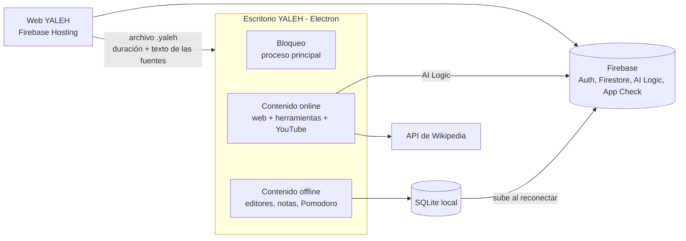

# Brief — YALEH v1

> Especificación de la versión 1. Autor: Mario Víctor Brañez Rodriguez (TECBA, Cochabamba).
> Fecha: 29 de septiembre de 2026. **Revisión 1.8** (04/10/2026): asistente de IA sin conexión (modelo local Qwen3.5-4B) en la versión 1. **Revisión 1.7** (03/10/2026): pestañas internas, ofimática con exportación, historial y estadísticas desde SQLite; la sincronización con Firestore pasa a la versión 2. **Revisión 1.6** (03/10/2026): la web ya no usa la IA; el espacio de trabajo con IA existe solo en el kiosko del escritorio. **Revisión 1.5** (29/09/2026): la web y el escritorio funcionan por separado y se unen solo con un **archivo de sesión .yaleh**, al estilo de Safe Exam Browser. La 1.4 agregó Firebase, la vista NotebookLM, la extracción de texto y la IA; la 1.3, la detección del modo y SQLite; la 1.2 eliminó la salida de emergencia; la 1.1 incorporó las decisiones del plan de trabajo (sección 16).
> Documento complementario: `INFORME_ANALISIS_SRB.md` (análisis del MVP actual).
> El diseño visual se define **después**; en esta versión no se rediseña la interfaz.
> Este documento es la **fuente de verdad** del proyecto: si el código lo contradice, gana el brief.

---

## 1. Qué es YALEH

YALEH es un entorno de estudio para estudiantes del TECBA con problemas de concentración. Tiene dos aplicaciones:

- **Web:** el centro de trabajo con IA. El estudiante inicia sesión, carga sus materiales, trabaja con el asistente y prepara su sesión de concentración.
- **Escritorio (Electron):** bloquea el sistema operativo durante la sesión, al estilo de Safe Exam Browser. Funciona con o sin internet.

No hay navegación libre por internet. La información la busca el asistente de IA, y el estudiante solo accede a herramientas autorizadas: Google Workspace, Canva, Gamma, Moodle y Classroom.

El proyecto parte del MVP existente ("Safe Research Browser"), que se **reorganiza**, no se rehace.

---

## 2. Decisiones cerradas

| Tema | Decisión |
| --- | --- |
| Productos | Dos aplicaciones en v1: web y escritorio, **independientes**. Se unen solo con el archivo de sesión `.yaleh` que descarga la web (revisión 1.5) |
| Archivo de sesión | JSON `.yaleh` con la duración y el texto de las fuentes; vale 24 horas y se usa una sola vez (sección 4.1) |
| Función principal del escritorio | Bloquear el sistema operativo durante la sesión, con o sin conexión |
| Modo | Lo define el escritorio al empezar la sesión: con conexión es online (herramientas e IA); sin conexión, offline (módulos locales). El escritorio no inicia sesión con Google. El escritorio detecta la conexión en el proceso principal: online si `net.isOnline()` es verdadero y la web de YALEH responde una petición HTTPS en menos de 5 segundos (cualquier respuesta HTTP cuenta). Se vuelve a comprobar cada 30 segundos, al volver de la suspensión y con los eventos de red |
| Navegación | Sin navegación libre; la IA busca la información |
| Enciclopedia (Encarta) | Eliminada |
| IA en v1 | Solo en línea: Gemini mediante Firebase AI Logic (API de desarrollador de Gemini, nivel gratuito) |
| Búsqueda de información en v1 | **API pública de Wikipedia en español** (`es.wikipedia.org`); los artículos se pasan a Gemini como contexto. Detrás de una interfaz de proveedor de búsqueda para agregar OpenAlex en v2 (sección 7) |
| Búsqueda con Google | **Fuera de v1** (no está disponible en el nivel gratuito; ver sección 7) |
| App Check | **Obligatorio para AI Logic** (verificado el 29/09/2026: sin token válido, la IA responde 401). Web publicada: Google Cloud Fraud Defense (reCAPTCHA Enterprise) con `ReCaptchaEnterpriseProvider`. Escritorio (`file://`) y `localhost`: token de depuración registrado (provisional, ver sección 7.4) |
| IA local | **v1** desde la revisión 1.8 (sección 7.5): Qwen3.5-4B con llama.cpp, descargado aparte desde la bienvenida del escritorio |
| Backend | Firebase, plan gratuito **Spark**: Authentication, Firestore, Hosting, AI Logic y App Check. **Sin servidor propio**. Proyecto `Yaleh` (ID `yaleh-fbe1c`) |
| Base de datos local | SQLite en el escritorio, con el módulo integrado `node:sqlite` |
| Runtime | Node.js y Electron |
| Vista principal | Estilo NotebookLM, en tres columnas |
| Mapas mentales | v2 (no olvidar) |
| Ofimática | Editores propios en el escritorio con exportación a `.docx`, `.xlsx` y `.pptx` |
| Google Workspace | Solo en modo online |
| Reproductor de YouTube | Embebido, solo en el escritorio online |
| Salida anticipada | **No existe.** No hay salida de emergencia ni código: la sesión solo termina al cumplirse el tiempo (o apagando o reiniciando el equipo) |
| Duración de la sesión | Entre 1 y **180 minutos** (`shared/config.ts`) |
| Confirmación | Antes de entrar al kiosko, pantalla de confirmación con los archivos cargados, la duración y el aviso de que no se puede salir (sección 4.3) |
| Sesión interrumpida | Si la app se cierra durante una sesión (apagado, reinicio o cierre forzado), al volver a abrirla se registra como interrumpida y, si aún queda tiempo, se ofrece retomarla |
| Nombre | YALEH (reemplaza a "SRB" y "Safe Research Browser" en todo el código y la interfaz) |

---

## 3. Arquitectura general

El escritorio es un **contenedor bloqueado** con dos capas independientes:

1. **Bloqueo:** vive en el proceso principal de Electron y funciona siempre, con o sin red.
2. **Contenido:** cambia según el modo.
   - Online: la misma interfaz de YALEH (compilación local) con las fuentes guardadas en SQLite, la IA y las herramientas en pestañas.
   - Offline: muestra los módulos locales (editores, notas, Pomodoro, archivos).



No hay servidor propio. Firebase AI Logic protege la clave de Gemini, App Check limita el acceso a la app legítima, las reglas de seguridad de Firestore controlan el acceso a los datos y la web se publica en Firebase Hosting.

### Organización del código (aprobada)

**Un solo paquete** (sin monorepo) y **una sola compilación de la interfaz**:

- `src/`: interfaz React compartida por la web y el escritorio. Se compila una vez en `dist/` con `base: './'`; esa misma salida se publica en Firebase Hosting y se incluye en el instalador del escritorio.
- `electron/`: proceso principal y preload en TypeScript, empaquetados con esbuild en `dist-electron/`. El preload se empaqueta como un único archivo CommonJS, requisito de `sandbox: true`.
- `shared/`: módulo de configuración único (modelos de Gemini, proveedor de App Check, sitios permitidos, límites) y tipos de los canales IPC, usado por el proceso principal y la interfaz.

La interfaz detecta la plataforma (`window.electronAPI` presente o no) y el modo (online u offline, informado por el proceso principal) para mostrar u ocultar funciones.

Se descartó el monorepo (`apps/web`, `apps/desktop`, `packages/shared`): con un solo desarrollador y casi toda la interfaz compartida, complica electron-builder y la gestión de dependencias sin aportar nada que `shared/` no resuelva.

---

## 4. Flujos de sesión

### 4.1 Sesión preparada en la web (archivo .yaleh)

*Revisión 1.5:* la web y el escritorio funcionan por separado y se unen solo con un archivo de sesión, como Safe Exam Browser. La web ya no abre el escritorio (no hay enlaces `yaleh://`) y el escritorio no inicia sesión con Google.

1. El estudiante inicia sesión en la web con Google (Firebase Authentication).
2. Carga sus archivos en la dropzone; el texto se extrae (y se guarda en Firestore) para incluirlo en el archivo. *Revisión 1.6:* la web no tiene espacio de trabajo ni IA.
3. Configura el tiempo (25, 50 o 90 minutos, o manual hasta 180) y confirma.
4. Pulsa **"Descargar archivo de sesión"**. La web muestra: "Abre el archivo con la aplicación de escritorio YALEH".
5. En el escritorio, el estudiante abre el archivo (botón "Abrir archivo de sesión (.yaleh)", arrastrándolo a la ventana, o con la app abierta por el archivo). El proceso principal lo valida; si es válido, guarda las fuentes en SQLite, **bloquea el equipo y empieza el tiempo de inmediato**. Si está caducado, dañado o ya se usó, muestra un mensaje claro y no bloquea.
6. Modo: con conexión, el kiosko muestra las herramientas y la IA (AI Logic no necesita Firebase Auth); sin conexión, solo módulos locales.

**Formato del archivo `.yaleh` (JSON, versión 1):** `format` = "yaleh-session", `version` = 1, `sessionId` (nuevo en cada descarga), `createdAt`, `expiresAt` (24 horas), `createdBy` (nombre y correo, solo para mostrar), `durationSeconds` (1 a 180 minutos), `sources` [{ `id`, `name`, `type`, `size`, `text` }] con el texto ya extraído y `checksum` (SHA-256 del contenido, en un orden de campos fijo). Tamaño máximo: 50 MB. El checksum solo detecta archivos dañados: el propio estudiante crea su archivo, así que no hay amenaza de manipulación. El uso único se controla en el escritorio con el `sessionId` registrado en SQLite.

### 4.2 Sesión local (empieza en el escritorio)

**El escritorio no tiene login:** al abrirse muestra una **bienvenida** (con y sin conexión) con el botón principal **"Iniciar"** y el secundario **"Abrir archivo de sesión (.yaleh)"**, que abre un diálogo del sistema desde el proceso principal (solo fuera de la sesión).

1. "Iniciar" → dropzone (texto guardado en SQLite).
2. Configura el tiempo.
3. Confirma la sesión en la pantalla de confirmación.
4. Se activa el kiosko. El modo lo decide el proceso principal según la conexión en ese momento.

**Kiosko en modo offline:** solo módulos locales (editores, Pomodoro, archivos, historial y estadísticas). Las herramientas online (Workspace, Classroom, Moodle, Canva, Gamma) no se muestran. La IA la atiende el asistente sin conexión si está descargado (sección 7.5); si no, muestra "Disponible próximamente" con la indicación para descargarlo.

### 4.3 Durante la sesión (ambos modos)

- El proceso principal cuenta el tiempo. No se puede romper desde la aplicación.
- **No hay salida anticipada.** No existe salida de emergencia ni código: la sesión solo termina al cumplirse el tiempo. La única forma de salir antes es apagar o reiniciar el equipo (o forzar el cierre con Ctrl+Alt+Supr, que Windows no permite bloquear).
- **Confirmación previa.** Antes de entrar al kiosko (flujo local) o de descargar el archivo (web), una pantalla muestra:
  - Los archivos cargados y la pregunta "¿Cargaste todos los archivos que necesitas?", con la opción de volver a la dropzone.
  - La duración elegida (máximo 180 minutos).
  - El aviso: "No podrás salir hasta que termine el tiempo. Solo apagando o reiniciando el equipo."
  - El estudiante confirma con un botón explícito.
- **Sesión interrumpida.** Al iniciar la sesión, el proceso principal guarda su estado (inicio y `sessionEndsAt`). Si la app se abre y encuentra una sesión activa sin terminar, la registra como "interrumpida" y, si todavía queda tiempo, ofrece retomarla con el tiempo restante (el tiempo sigue corriendo mientras el equipo está apagado).
- **Registro.** Las pérdidas de foco de la ventana y las interrupciones se registran con fecha y hora.
- **Salida para desarrollo.** Solo cuando la app no está empaquetada existe un atajo (Ctrl+Shift+F12) que libera el kiosko y queda registrado. En la versión empaquetada no existe.
- Si se corta internet a mitad de sesión, el kiosko sigue cerrado y el tiempo sigue corriendo. Las herramientas online y la IA se ocultan, aparece el aviso **"Sin conexión: puedes seguir con los módulos locales"** y se registran los eventos `connection-lost` y `connection-restored`. Al volver la conexión, las herramientas reaparecen. Todos los datos de la sesión del escritorio están en SQLite.

### 4.4 Al terminar

1. Se cumple el tiempo y se muestra el resumen de la sesión.
2. La sesión se guarda en SQLite.
3. Se libera el sistema operativo.
4. La sesión aparece en el **Historial** y en las **Estadísticas** del escritorio (SQLite). No se sincroniza con Firestore en v1 (revisión 1.7, pasa a la versión 2).

### 4.5 Inicio de sesión dentro del kiosko

*Eliminado en la revisión 1.5.* El escritorio no inicia sesión con Google: se eliminaron la página `auth-desktop.html`, el `state` y los enlaces `yaleh://auth` y `yaleh://sesion` (el diseño anterior queda en el tag de git `demo-antes-archivo`). Workspace y Classroom siguen pidiendo su propio inicio de sesión dentro del kiosko (riesgo aceptado, sección 13).

---

## 5. Aplicación web

La web es independiente (se ejecuta sola con `npm run dev` o en Firebase Hosting) y **no bloquea nada**: el bloqueo es exclusivo del escritorio. El escritorio usa la misma interfaz compilada.

### 5.1 Flujo de entrada

Inicio de sesión con Google → dropzone → configurar tiempo → confirmación → **"Descargar archivo de sesión"** → instrucciones para abrirlo en el escritorio, con "Descargar otro archivo" y "Preparar una nueva sesión" (vuelve a la dropzone). *Revisión 1.6:* la web no pasa por la IA; el espacio de trabajo (sección 5.2) existe solo en el kiosko del escritorio.

### 5.2 Vista principal (estilo NotebookLM)

| Columna | Contenido |
| --- | --- |
| Izquierda: **Fuentes** | Archivos cargados en la dropzone |
| Centro: **Chat** | Conversación con el asistente sobre los materiales y búsquedas en Wikipedia |
| Derecha: **Estudio** | Resumen, cuestionario, tarjetas de estudio e informe generados por la IA; recuadro de **notas** |

En pantallas angostas, las columnas se convierten en pestañas. El mapa mental queda para v2.

### 5.3 Sidebar izquierdo (se oculta con un botón)

- **Estadísticas** (dashboard).
- **Pomodoro.**
- **Herramientas:** Google Workspace, Canva, Gamma, Moodle y Classroom. En el navegador se abren en una pestaña nueva del navegador; en el kiosko, en pestañas internas.
- **Actividades recientes:** sesiones pasadas.
- **Configuración:** botón visible; su función se define después.

### 5.4 Otros requisitos

- Mensaje de bienvenida al usuario (solo en la web).
- Pestañas internas para abrir varias vistas a la vez.
- Los enlaces dentro de las respuestas de la IA quedan **bloqueados** por ahora: las fuentes se muestran como texto.

### 5.5 Se elimina de la web

Barra superior completa (buscador y botón de configuración), Enciclopedia SRB, videos educativos, material offline, sección "Task" y ofimática.

---

## 6. Aplicación de escritorio

| Función | Modo online | Modo offline |
| --- | --- | --- |
| Bloqueo del sistema operativo | Sí | Sí |
| Inicio | Bienvenida: "Iniciar" (flujo local) o "Abrir archivo de sesión (.yaleh)" | Igual |
| Vista principal | La interfaz de YALEH (Fuentes · Chat · Estudio) con las fuentes guardadas en SQLite | Misma distribución; el **chat** y las **funciones de IA de la columna de estudio** muestran **"Disponible próximamente"**. Las **notas** funcionan |
| Asistente de IA | Sí (Gemini, "Asistente en línea") | Sí, si se descargó el modelo ("Asistente sin conexión"): chat, resumen y tarjetas. Cuestionario, informe y Wikipedia, solo con conexión |
| Workspace, Canva, Gamma, Moodle, Classroom | Pestañas internas | No visibles |
| Reproductor de YouTube | Sí | No |
| Editores de ofimática | Sí | Sí |
| Notas, archivos y Pomodoro | Sí | Sí |
| Historial y estadísticas | SQLite (este equipo) | SQLite (este equipo) |

### 6.1 Editores de ofimática

Se construyen dentro de la aplicación con librerías web. **No se usa FreeOffice**: es un programa aparte que rompería el aislamiento del kiosko y no se puede incluir en el instalador.

| Editor | Base | Exporta a |
| --- | --- | --- |
| Documento | Editor de texto enriquecido (TipTap), partiendo del editor actual del MVP | `.docx` (librería `docx`). El `.pdf` pasa a la versión 2 (revisión 1.7) |
| Hoja de cálculo | Cuadrícula de celdas en JavaScript, partiendo de la hoja actual del MVP | `.xlsx` (ExcelJS) |
| Presentación | Editor simple de diapositivas, partiendo del **editor básico que ya tiene el MVP** | `.pptx` (PptxGenJS) |

- La exportación la hace el **proceso principal** y guarda en una carpeta fija: `Documentos/YALEH`. El estudiante nunca ve el explorador de archivos durante la sesión.
- Nombre del archivo: título + fecha y hora (`Título AAAA-MM-DD HH-mm-ss.docx`); nunca se sobrescribe un archivo existente. La interfaz muestra la ruta donde quedó guardado.
- Funcionan igual con y sin conexión.
- Los nombres "TextMaker" y "PlanMaker" son marcas de SoftMaker: se reemplazan por "Documento", "Hoja de cálculo" y "Presentación".

### 6.2 Reproductor de YouTube (modo online)

1. Si el estudiante hace clic en un enlace de YouTube dentro de Moodle o Classroom, el proceso principal intercepta la navegación.
2. Extrae el identificador del video (`youtube.com/watch?v=`, `youtu.be/`, `youtube.com/shorts/`).
3. Lo abre en una pestaña interna con el reproductor oficial embebido (`https://www.youtube-nocookie.com/embed/<id>`), **insertado desde una página propia de YALEH** con `referrerpolicy="strict-origin-when-cross-origin"`. Desde finales de 2025, YouTube muestra el "Error 153" si el reproductor no recibe un `Referer`, así que no se puede cargar la URL de inserción directamente.
4. Cualquier intento de ir a youtube.com desde el reproductor se bloquea.
5. Si el autor desactivó la inserción del video, se muestra un aviso en lugar del video.

---

## 7. Asistente IA y búsqueda de información

El asistente usa Gemini a través de **Firebase AI Logic** con la **API de desarrollador de Gemini** en su nivel gratuito (proyecto en plan Spark, sin tarjeta).

### 7.1 Datos verificados en la documentación oficial (27/09/2026)

| Hecho | Consecuencia |
| --- | --- |
| `gemini-2.5-flash` se apaga el **16 de octubre de 2026** en la API de desarrollador, y los proyectos nuevos ya no pueden empezar a usarlo | No se usa |
| En AI Logic, la búsqueda con Google solo funciona con modelos Gemini 3.x | — |
| En el nivel gratuito de Gemini 3.x, la búsqueda con Google **no está disponible** (en el nivel pagado: 5.000 búsquedas al mes gratis, luego 14 USD por 1.000) | La búsqueda con Google queda fuera de v1 |
| Los términos de uso obligan a mostrar las "Search Suggestions" junto a cada respuesta con búsqueda, como enlaces que no se pueden bloquear ni modificar | Incompatible con el kiosko y con mostrar las fuentes como texto |
| `gemini-3.8-flash` y `gemini-3.5-flash-lite` son estables y no requieren facturación | Modelos de v1 |
| **Desde el 2 de noviembre de 2026, AI Logic exige App Check con enforcement** | App Check es requisito de v1 |

En el nivel gratuito, Google puede usar el contenido para mejorar sus productos: debe indicarse en la política de privacidad.

### 7.2 Modelos y búsqueda

| Tarea | Cómo |
| --- | --- |
| Chat sobre los archivos, resumen, cuestionario, tarjetas, informe | `gemini-3.5-flash-lite`, con respaldo automático a `gemini-3.8-flash` si hay saturación o falta cuota (revisión 1.4: el 29/09/2026 `gemini-3.8-flash` respondía "alta demanda" y 429 en el nivel gratuito) |
| Buscar información | **API pública de Wikipedia en español** (`es.wikipedia.org`, búsqueda y extractos de artículos). Los artículos encontrados se pasan a Gemini como contexto |

- La búsqueda vive detrás de una **interfaz de proveedor de búsqueda** (por ejemplo `SearchProvider`), para agregar OpenAlex en v2 sin tocar el asistente.
- Los nombres de los modelos y el proveedor de App Check van en `shared/config.ts`, no dispersos en el código.
- Las llamadas a la API de Wikipedia se identifican con la cabecera `Api-User-Agent` que pide Wikimedia.

### 7.3 Requisitos

- Cuestionarios y tarjetas con **salida estructurada** (esquema JSON), para que la interfaz siempre pueda mostrarlos.
- Las respuestas se basan en el texto de los archivos del estudiante (sección 8) y, cuando se busca, en los artículos de Wikipedia.
- Las fuentes se muestran como texto, sin enlaces: título del artículo y "Wikipedia" (licencia CC BY-SA).
- El texto de las respuestas nunca se inserta como HTML sin sanitizar (hoy existe un XSS en `AIWorkPanel.tsx`).
- Cuando se agota la cuota gratuita (error 429), la interfaz muestra un mensaje claro.

### 7.4 App Check

- Proveedor: **Google Cloud Fraud Defense** (antes reCAPTCHA Enterprise), registrado en la consola de Firebase, con `ReCaptchaEnterpriseProvider`. La consola ya no permite registrar reCAPTCHA v3.
- El proveedor y la clave del sitio se definen en `shared/config.ts` y en las variables de entorno de Vite.
- **AI Logic ya exige App Check** (el servicio no admite desactivar el enforcement). Firestore y Authentication siguen sin enforcement.
- Clave del sitio registrada: `6LdbPtMtAAAAADFcG-cMeEb3tAOlEl51cu6dMBhX` (la única clave de Fraud Defense del proyecto; dominios: `yaleh-fbe1c.web.app`, `yaleh-fbe1c.firebaseapp.com`, `localhost`). El 29/09/2026 App Check tenía registrada por error otra clave inexistente; se corrigió con la API de App Check. Verificado: reCAPTCHA → App Check → Gemini responde en la web publicada.
- **Escritorio (`file://`) y `localhost`:** reCAPTCHA solo funciona en los dominios registrados, así que usan un **token de depuración** registrado en la consola ("YALEH escritorio demo (borrar)"). Es provisional: el token viaja dentro del instalador y permite saltarse App Check. Alternativa definitiva pendiente: cargar la web publicada dentro del kiosko en modo online, o un proveedor personalizado.
- App Check no se usa en modo offline: el asistente sin conexión no llama a ningún servicio.

### 7.5 Asistente sin conexión (revisión 1.8)

**Por qué en v1:** disponibilidad sin internet (el modo offline deja de quedar sin IA), privacidad (los documentos del estudiante no salen del equipo), sin cuota ni costo (no consume el nivel gratuito de Gemini) y sin depender de App Check.

| Tema | Decisión |
| --- | --- |
| Modelo | **Qwen3.5-4B**, GGUF cuantizado Q4_K_M (2,74 GB), licencia **Apache 2.0** (permite redistribuirlo; el aviso se muestra junto a la descarga). Solo el modelo de texto, sin el módulo de visión (`mmproj`) |
| Por qué ese modelo | La mejor calidad en español del rango evaluado (1 000 a 4 000 millones de parámetros), JSON fiable para las tarjetas y el resumen, y licencia que permite redistribuirlo. **Descartados:** Qwen3.5-2B (1,28 GB, 2 a 3 veces más rápido, pero menos preciso con documentos largos y con el JSON) y Gemma 4 E2B (3,46 GB para unos 2 300 millones de parámetros efectivos) |
| Motor | **llama.cpp mediante node-llama-cpp**, en un `utilityProcess` de Electron para no bloquear la interfaz ni el proceso principal. Verificado con Electron 42 en Windows (03/10/2026). GPU automática (Vulkan en la gráfica integrada; si no hay, CPU): el primer texto llega en ~18 s frente a ~55 s solo con CPU. Si el proceso del modelo se cae, el siguiente intento usa solo la CPU |
| Modo de "pensamiento" | Desactivado: responde directo |
| Descarga | **No va en el instalador.** En la bienvenida del escritorio, con conexión y fuera de la sesión: "Descargar asistente sin conexión", a la carpeta de datos de la app, con barra de progreso, reanudación si se corta (petición Range) y verificación SHA-256. **Nunca se descarga durante el kiosko**: si empieza una sesión, la descarga se pausa |
| Requisitos | Al menos **8 GB de RAM** y el espacio libre necesario. Si no se cumplen, aviso claro con el motivo y sin ofrecer la descarga |
| Fragmentos | Búsqueda de texto completo con **FTS5** de SQLite (migración 3) sobre fragmentos de 1 000 caracteres del texto de `source_chunks`. Al modelo solo se envían los fragmentos más relevantes (chat) o repartidos a lo largo de las fuentes (resumen y tarjetas), hasta 6 000 caracteres (~1 700 tokens), dentro de su contexto de 8 192 tokens. Con 12 000, el primer texto tardaba ~110 s |
| Funciones | Chat sobre los documentos, resumen y tarjetas de estudio (esquema JSON impuesto con una gramática de llama.cpp). Cuestionario, informe y Wikipedia siguen solo con conexión |
| Proveedor común | Gemini y el modelo local detrás de una misma interfaz (como `SearchProvider`). Con conexión (sesión online), Gemini; sin conexión y con el modelo instalado, el local; sin modelo, "Disponible próximamente" con la indicación de cómo descargarlo |
| Interfaz | Indica qué asistente responde ("Asistente en línea" / "Asistente sin conexión") y muestra las respuestas a medida que se generan |
| Módulo nativo | node-llama-cpp **rompe la regla de "sin módulos nativos"** (sección 8.5): trae binarios precompilados de llama.cpp para Windows. En el empaquetado (fase 11) debe quedar fuera del asar |
| Respuestas breves | Para que el estudiante no espere de más (04/10/2026): chat de ~150 tokens salvo que pida más detalle, resumen de 4 ideas clave y 5 tarjetas. Aviso fijo: "El asistente sin conexión es más lento; puede tardar hasta un minuto." |
| Tiempos | Medidos en el equipo de desarrollo (i7-1255U, Iris Xe), con respuestas breves: chat de 44 a 61 s con el primer texto a los ~20 s, resumen ~103 s, 5 tarjetas ~144 s. Detalle en `docs/MEDICIONES_IA_LOCAL.md` (`npm run bench:local-ai`) |

---

## 8. Datos y archivos

### 8.1 Restricción del plan gratuito

Desde el 3 de febrero de 2026, Cloud Storage for Firebase exige el plan Blaze. **No se usa Cloud Storage.** Los archivos originales nunca se suben: quedan en el equipo del estudiante.

### 8.2 Qué se guarda y dónde

| Dato | Web y escritorio online | Escritorio offline |
| --- | --- | --- |
| Usuario y perfil | Firestore | Perfil local en SQLite |
| Configuración de la sesión | Firestore | SQLite |
| Texto extraído de los archivos | Firestore, dividido en partes (máximo 1 MiB por documento) | SQLite |
| Notas | Firestore | SQLite |
| Resultados de la IA | Firestore | — |
| Historial de sesiones y métricas | Firestore | SQLite, se sube al reconectar |
| Registro de eventos de la sesión (pérdidas de foco, interrupciones) | SQLite (se sube a Firestore con la sesión) | SQLite |
| Documentos de ofimática | `Documentos/YALEH` | `Documentos/YALEH` |

Guardar el texto extraído en Firestore resuelve que los archivos cargados en el navegador no son visibles para la web que corre dentro del kiosko (son navegadores distintos).

### 8.3 Modelo de datos propuesto (Firestore)

```
users/{uid}
users/{uid}/sessions/{sessionId}        # duración, inicio, fin, estado, modo, eventos (pérdidas de foco, interrupción)
users/{uid}/sessions/{sessionId}/sources/{sourceId}          # nombre, tipo, tamaño
users/{uid}/sessions/{sessionId}/sources/{sourceId}/chunks/{n}  # texto extraído
users/{uid}/sessions/{sessionId}/notes/{noteId}
users/{uid}/sessions/{sessionId}/studyItems/{itemId}        # resumen | cuestionario | tarjetas | informe
```

Reglas de seguridad: cada usuario solo puede leer y escribir bajo `users/{su uid}`.

### 8.4 Formatos admitidos en v1

PDF con texto, DOCX y TXT. Los PDF escaneados quedan fuera. La extracción se hace en el cliente (`pdf.js` para PDF, `mammoth` para DOCX). El límite de la dropzone es de 500 MB; la validación no debe depender solo del tipo MIME.

### 8.5 SQLite y sincronización

- SQLite vive en el proceso principal con el módulo integrado **`node:sqlite`** (disponible en Electron 42, Node 24.16). No necesita compilar módulos nativos en Windows. El SQLite de Electron trae FTS5 (el de Node 22 no): las pruebas corren con el Node de Electron.
- **Migración 3 (revisión 1.8):** `source_passages` (fragmentos de cada fuente) y `source_passages_fts` (FTS5) para el asistente sin conexión.
- Base: `app.getPath('userData')/yaleh.db`, en modo WAL, con migraciones versionadas registradas en `schema_migrations` (una migración publicada nunca se edita; los cambios van en una nueva).
- Tablas (migración 1):
  - `sessions`: `id`, `mode` (online/offline), `started_at`, `ends_at` (epoch en ms), `duration_seconds`, `status` (active/finished/interrupted), `owner_uid` y `synced_at` (vacíos hasta la fase 10).
  - `session_events`: `id`, `session_id`, `type`, `at` (ISO 8601), `detail`. Sin clave foránea: hay eventos sin sesión (enlaces inválidos).
  - `local_profile` (perfil local del equipo) y `settings` (clave-valor).
- Los datos JSON de la fase 2 (`session.json` y `events.json`) se importan una sola vez en el primer arranque y se renombran a `.migrated`. Una sesión activa importada se sigue detectando como interrumpida.
- `npm run db:inspect` muestra las últimas sesiones (con pérdidas de foco y cortes de red) y eventos, en solo lectura.
- La interfaz accede a los datos solo por IPC; nunca abre la base.
- **Historial y estadísticas (fase 10):** se calculan solo con SQLite. Historial: fecha, duración, modo, estado, pérdidas de foco, cortes de red e interrupciones. Estadísticas: minutos de concentración por día y por semana (solo suman las sesiones completadas, con su duración completa), completadas frente a interrumpidas y pérdidas de foco promedio por sesión.
- **Sincronización con Firestore: versión 2** (revisión 1.7). El escritorio no tiene cuenta de Google desde la revisión 1.5, así que no hay a qué cuenta subir las sesiones. `owner_uid` y `synced_at` quedan vacíos.

---

## 9. Seguridad del kiosko

Todo el bloqueo se aplica en el **proceso principal**, nunca en la interfaz. Ver `INFORME_ANALISIS_SRB.md`, sección 9, para los problemas del MVP.

- [x] Pantalla completa en modo kiosko, sin menú y siempre al frente (nivel `screen-saver`) durante la sesión; si la ventana pierde el foco, lo recupera y registra la pérdida. *(fase 2)*
- [x] Atajos del sistema bloqueados con `before-input-event` y `globalShortcut` donde Windows lo permite (Alt+F4, F5, F11, F12, Ctrl+W, Ctrl+R, Ctrl+Shift+I y similares). *(fase 2)* **Windows no permite capturar Alt+Tab ni la tecla Windows** con `globalShortcut`; se mitiga con la ventana siempre al frente al máximo nivel, recuperando el foco si se pierde y registrando cada pérdida de foco. Estas limitaciones y Ctrl+Alt+Supr se documentan.
- [x] Lista de sitios permitidos con `session.webRequest.onBeforeRequest`, filtrando solo `mainFrame` y `subFrame`, para no bloquear los recursos que cargan Google o Canva (ni las llamadas a la API de Wikipedia). *(fase 2)*
- [x] `will-navigate` y `setWindowOpenHandler` controlados en todas las vistas: toda ventana o página nueva se abre como pestaña interna o se bloquea. *(fase 2: por ahora se deniegan; en la fase 8 se abren como pestañas)*
- [x] `shell.openExternal` restringido a la web de YALEH (`yaleh-fbe1c.web.app` y `yaleh-fbe1c.firebaseapp.com`), desde la que se inicia sesión con Google. *(fase 2)*
- [x] DevTools deshabilitadas en la versión empaquetada. *(fase 2)*
- [x] `contextIsolation: true`, `sandbox: true`, `nodeIntegration: false`, `webSecurity: true` y `contextBridge` con canales IPC definidos y validados. El proceso principal comprueba el origen de cada mensaje IPC. *(fase 2)*
- [x] El temporizador vive en el proceso principal (`sessionEndsAt`); la interfaz solo lo muestra. *(fase 2)*
- [x] La interfaz no puede salir del kiosko antes de tiempo: se rechazan el cierre de la app y de la ventana mientras la sesión está activa. No hay salida de emergencia. *(fase 2)*
- [x] Content-Security-Policy en la web, sin `'unsafe-inline'` para scripts. *(fase 2)*
- [x] ~~El enlace directo de autenticación valida un `state` aleatorio~~. *No aplica desde la revisión 1.5: no hay enlaces `yaleh://`; el escritorio solo acepta archivos `.yaleh` validados por el proceso principal.*

**Sitios permitidos en modo online:** todo lo demás se bloquea. La lista vive en **un único módulo de configuración** (`shared/config.ts`) compartido por el proceso principal y la interfaz. Solo HTTPS.

| Sitio | Motivo |
| --- | --- |
| `yaleh-fbe1c.web.app`, `yaleh-fbe1c.firebaseapp.com` | Web de YALEH y marco de Firebase Auth |
| `workspace.google.com`, `docs.google.com`, `sheets.google.com`, `slides.google.com`, `drive.google.com` | Google Workspace |
| `classroom.google.com` | Google Classroom |
| `accounts.google.com` | Inicio de sesión de Google |
| `accounts.youtube.com` | Paso del inicio de sesión de Google que fija la sesión; sin él el login se interrumpe |
| `www.google.com`, solo la ruta `/recaptcha/` | App Check (Fraud Defense) carga su marco desde ahí (fase 4) |
| `canva.com` y subdominios | Canva |
| `gamma.app` y subdominios | Gamma |
| `moodle-108854-0.cloudclusters.net` | Moodle del TECBA (entrada: `/login/`) |
| `www.youtube-nocookie.com` | Reproductor de YouTube embebido (fase 8) |
| `localhost:5173` | Servidor de Vite, solo sin empaquetar |

---

## 10. Pestañas internas

Cada función o página nueva se abre en una pestaña nueva, como en un navegador, para no perder el progreso.

- Máximo **ocho pestañas**. Al llegar al límite se muestra un aviso.
- Las ventanas nuevas que abre un sitio permitido (`target="_blank"`, `window.open`) se convierten en pestañas internas. Las de sitios no permitidos se descartan.
- Los enlaces de YouTube (desde cualquier pestaña) se abren en el reproductor propio (sección 6.2), alojado en Firebase Hosting (`/youtube.html?v=<id>`), por lo que solo funciona con conexión. youtube.com no se puede abrir directamente.
- En el escritorio, las páginas externas se cargan con **`WebContentsView`**, no con iframes. Google y Canva no permiten mostrarse en iframes, y ese es el error actual del MVP. Como `WebContentsView` se dibuja encima de la interfaz, la vista se oculta mientras haya un menú o diálogo de la interfaz abierto.
- En el navegador web, las pestañas internas solo contienen vistas propias (chat, estudio, notas, estadísticas).
- Cada pestaña conserva su estado al cambiar entre ellas.

---

## 11. Qué hacer con el MVP actual

| Acción | Elementos |
| --- | --- |
| **Reutilizar** | Kiosko y pestañas; dropzone; configuración del tiempo; Pomodoro; editores de documento, hoja y presentación como base; enlace directo del login (renombrar el protocolo a `yaleh://`); sidebar; reducer y contexto |
| **Mover al proceso principal** | Lista de sitios permitidos, salida del kiosko, temporizador |
| **Corregir** | Temporizador al doble de velocidad (intervalos duplicados en `KioskLayout.tsx` y `BottomBar.tsx`); cierre de la aplicación antes del resumen; errores de `tsc --noEmit` y la opción inválida de `tsconfig.json` |
| **Reemplazar** | Iframes de Workspace por `WebContentsView`; IA simulada por Gemini real; usuario con datos fijos por autenticación real; página de login de Firebase Hosting por una versionada en este repositorio |
| **Agregar** | Firebase real (con App Check), SQLite, extracción de texto, búsqueda en Wikipedia, exportación a Office, reproductor de YouTube, pantalla "No estás conectado", scripts `typecheck` y `test`, empaquetado con `electron-builder` y asociación del tipo de archivo `.yaleh` (revisión 1.5) |
| **Renombrar** | "SRB", "Safe Research Browser", "TextMaker", "PlanMaker" y el nombre del paquete (`react-vite-tailwind`) |
| **Eliminar** | Enciclopedia SRB (`EncartaPanel.tsx` y sus imágenes), videos educativos, material offline, barra superior con buscador, accesos a Duolingo, Wikipedia, Khan Academy, Coursera, SciELO y Google Scholar, botón de login con Facebook, configuración de tema sin efecto, informes antiguos `AI_APPLICATION_REPORT.md` y `.json` |

---

## 12. Alcance

| Versión 1 (esta entrega) | Versión 2 |
| --- | --- |
| Web: login con Google, dropzone, tiempo, vista NotebookLM, sidebar, bienvenida | Mapas mentales generados por la IA |
| IA en línea: chat, resumen, cuestionario, tarjetas, informe, búsqueda en Wikipedia | Cuestionario e informe con el asistente sin conexión |
| App Check con Fraud Defense | Búsqueda en OpenAlex (mismo `SearchProvider`) |
| Asistente sin conexión (Qwen3.5-4B, descarga aparte): chat, resumen y tarjetas | |
| Escritorio: kiosko en ambos modos, pantalla "No estás conectado" | Búsqueda con Google (requiere plan de pago y resolver los requisitos de visualización) |
| Pestañas internas (máximo 8) | Abrir enlaces desde las respuestas de la IA |
| Editores de documento, hoja y presentación con exportación | Función del botón de configuración |
| Reproductor de YouTube embebido | PDF escaneados (OCR) |
| Firestore (web), SQLite, historial y estadísticas locales | Bloqueo más profundo del sistema (Ctrl+Alt+Supr, Alt+Tab, tecla Windows) |
| Confirmación previa y recuperación de sesiones interrumpidas | Plan de pago de Gemini si se supera el límite |
| | Rediseño visual completo |
| | Sincronización del historial con Firestore (requiere definir la cuenta del escritorio) |
| | Exportación de documentos a `.pdf` |

---

## 13. Riesgos

| Riesgo | Plan |
| --- | --- |
| Google bloquea su login dentro de Electron | Login en el navegador del sistema + `signInWithCredential` (sección 4.5) |
| Workspace, Classroom o Canva no permiten iniciar sesión dentro de `WebContentsView` | **Riesgo aceptado.** Los editores propios cubren la ofimática; Workspace es complemento. Moodle no depende de Google |
| Retiro de modelos de Gemini (`gemini-2.5-flash` se apaga el 16/10/2026) | Resuelto: v1 usa `gemini-3.8-flash`. El modelo se cambia en `shared/config.ts` |
| App Check (Fraud Defense) puntúa mal o falla dentro de Electron | Probarlo al inicio de la fase de Firebase, antes de activar el enforcement (obligatorio desde el 2/11/2026) |
| Se supera el límite gratuito de Gemini, Firestore o Fraud Defense | Mensaje claro al usuario; revisar el uso en la consola de Firebase |
| La API de Wikipedia limita o rechaza las solicitudes | Cabecera `Api-User-Agent`, pocas solicitudes por pregunta y mensaje claro si falla |
| El reproductor de YouTube muestra "Error 153" | Página propia de YALEH que inserta el reproductor con `referrerpolicy` (sección 6.2) |
| Ctrl+Alt+Supr, Alt+Tab y la tecla Windows no se pueden bloquear | Limitación documentada; mitigación con ventana al frente y registro de pérdidas de foco |
| El estudiante queda bloqueado sin salida (por ejemplo, un fallo durante la sesión) | Apagar o reiniciar el equipo; al reabrir, la sesión aparece como interrumpida. Durante el desarrollo existe la salida Ctrl+Shift+F12 (solo sin empaquetar) |

---

## 14. Identidad (el diseño se define después)

- **Nombre:** YALEH. **Logo:** tortuga.
- **Colores:** amarillo dorado y negro. Modo claro con fondo gris tenue; modo oscuro con fondo negro y componentes en gris y dorado.
- En v1, los colores se centralizan en variables (tokens de Tailwind) para aplicar el diseño después sin tocar cada componente. Los tokens se definen en la fase 1 y cada componente se migra cuando se modifica en su fase, con un repaso final en la última fase.
- El dorado sobre gris claro no alcanza el contraste mínimo para textos: en modo claro se usa en botones y acentos con texto negro encima.

---

## 15. Pendientes fuera del código

- Diseño visual.
- ~~Extensión del archivo de sesión~~: `.yaleh` (revisión 1.5). Su asociación con la app (doble clic) se configura en el instalador, fase 11.
- Función del botón de configuración.
- Fecha de entrega.
- Actualizar el documento de proyecto de grado al cerrar este sprint.

### Configuración manual en la consola de Firebase (la hace Mario)

- [x] Proyecto `Yaleh` (ID `yaleh-fbe1c`) en plan Spark.
- [x] Authentication: proveedor de Google habilitado.
- [ ] Authentication: agregar los dominios autorizados.
- [x] Firestore: base creada en modo producción.
- [x] Firestore: reglas publicadas (fase 4).
- [x] AI Logic: API de desarrollador de Gemini habilitada (sin facturación).
- [x] App Check: registrado con Google Cloud Fraud Defense; clave corregida el 29/09/2026.
- [ ] App Check: borrar el token de depuración "YALEH escritorio demo (borrar)" cuando el escritorio deje de necesitarlo, y activar el enforcement de Firestore y Authentication.
- [x] Hosting: web publicada en `https://yaleh-fbe1c.web.app` (fase 4).

---

## 16. Registro de decisiones

### Revisión 1.1 — 28/09/2026 (aprobación del plan de trabajo)

| # | Tema | Decisión |
| --- | --- | --- |
| 1 | Organización del código | Un solo paquete, una sola compilación de la interfaz, `electron/` empaquetado con esbuild, `shared/` para la configuración (sección 3) |
| 2 | Base de datos local | `node:sqlite` en lugar de `better-sqlite3` |
| 3 | Orden de trabajo | SQLite básico antes que el flujo offline; vista principal antes de archivos e IA; pruebas de viabilidad al inicio de cada fase arriesgada |
| 4 | Búsqueda (4.1) | Opción C: API pública de Wikipedia en español como contexto para Gemini, fuentes como texto, detrás de `SearchProvider` para OpenAlex en v2 |
| 5 | App Check (4.2) | Fraud Defense con `ReCaptchaEnterpriseProvider`, proveedor en `shared/config.ts`; clave del sitio en la fase 4 |
| 6 | Paso de la web al escritorio (4.3) | Opción A: el escritorio se bloquea al recibir el enlace, inicia sesión por el navegador del sistema con `state`, y el tiempo cuenta desde que se confirma la duración |
| 7 | Login de Google en herramientas (4.4) | Riesgo aceptado (sección 13) |
| 8 | Código de emergencia (4.5) | ~~Lo define el estudiante; mismo código en ambos modos; hash en SQLite~~. **Reemplazada en la revisión 1.2:** no hay salida de emergencia |
| 9 | Escritorio abierto sin venir de la web | "Inicia tu sesión desde la web" (botón que abre el navegador) + opción de modo offline |
| 10 | Cuenta de las sesiones offline | La última cuenta que inició sesión en el equipo; si no hay, quedan locales |
| 11 | Vista offline | "Disponible próximamente" en el chat y en las funciones de IA de estudio; las notas funcionan |
| 12 | Corte de red a mitad de sesión | El resto se guarda en SQLite con el mismo ID y se sube después |
| 13 | Proyecto de Firebase | Nuevo proyecto `Yaleh` (`yaleh-fbe1c`); la página de login se rehace en el repositorio |
| 14 | Colores | Tokens en la fase 1 y migración gradual |
| 15 | Archivos antiguos | Se eliminan `AI_APPLICATION_REPORT.md` y `.json`; `dist/` se ignora en git |
| 16 | Editor de presentaciones | Se parte del editor básico del MVP (no es nuevo) |

### Revisión 1.2 — 28/09/2026 (inicio de la fase 2)

| # | Tema | Decisión |
| --- | --- | --- |
| 17 | Salida de emergencia | **Se elimina.** No hay código ni salida anticipada: la sesión solo termina al cumplirse el tiempo, o apagando o reiniciando el equipo |
| 18 | Confirmación previa | Pantalla antes del kiosko con los archivos cargados ("¿Cargaste todos los archivos que necesitas?", con opción de volver a la dropzone), la duración y el aviso "No podrás salir hasta que termine el tiempo. Solo apagando o reiniciando el equipo." Confirmación con botón explícito |
| 19 | Duración máxima | 180 minutos (`shared/config.ts`) |
| 20 | Sesión interrumpida | El proceso principal guarda el estado de la sesión al iniciarla (JSON en `userData` hasta la fase 3, luego SQLite). Si al abrir encuentra una sesión activa sin terminar, la registra como interrumpida y, si queda tiempo, ofrece retomarla con el tiempo restante |
| 21 | Registro de foco | Las pérdidas de foco se registran con fecha y hora |
| 22 | Salida para desarrollo | Ctrl+Shift+F12 libera el kiosko y queda registrado, solo cuando la app no está empaquetada |
| 23 | Bloqueo tras intentos fallidos | No aplica: solo tenía sentido con el código de emergencia |

### Revisión 1.3 — 28/09/2026 (fase 3)

| # | Tema | Decisión |
| --- | --- | --- |
| 24 | Moodle del TECBA | `https://moodle-108854-0.cloudclusters.net/login/` |
| 25 | Lista de sitios | Se aceptan `accounts.youtube.com` y `www.google.com/recaptcha/` (motivos en la sección 9) |
| 26 | Detección del modo | En el proceso principal: `net.isOnline()` + petición HTTPS a la web de YALEH (< 5 s, cualquier respuesta HTTP). Nueva comprobación cada 30 s, al volver de la suspensión y con los eventos de red |
| 27 | Inicio del escritorio | Sin login propio ni acceso como invitado. Pantallas "No estás conectado…" y "Inicia tu sesión desde la web" (sección 4.2) |
| 28 | Conexión perdida en una sesión online | Kiosko bloqueado y tiempo corriendo; se ocultan las herramientas online y la IA, aviso "Sin conexión: puedes seguir con los módulos locales" y eventos `connection-lost` / `connection-restored` |
| 29 | SQLite | Esquema de la sección 8.5, migraciones versionadas, importación única de los JSON de la fase 2 y `npm run db:inspect` |
| 30 | Sesión online de prueba | Solo sin empaquetar, hasta la fase 4 (el proceso principal rechaza sesiones online en la versión empaquetada) |

### Revisión 1.4 — 29/09/2026 (fases 4 a 7, preparación de la presentación)

| # | Tema | Decisión |
| --- | --- | --- |
| 31 | Interfaz del kiosko online | Se usa la compilación local (la misma que la web) con los datos de Firestore, no la web publicada cargada dentro del kiosko: evita confiar IPC a un origen remoto y cambiar de página a mitad de sesión |
| 32 | Momento del bloqueo | El escritorio se bloquea después del inicio de sesión de Google y de leer la sesión, no al recibir yaleh://sesion (el kiosko taparía el navegador) |
| 33 | Login de la web | Solo Google (`signInWithPopup`). Se eliminaron el login manual y el acceso como invitado |
| 34 | Espacio de trabajo en la web | La web puede abrir Fuentes · Chat · Estudio sin sesión de concentración (sin temporizador). La sesión de concentración siempre se abre en el escritorio |
| 35 | Herramientas en la web | Se abren en una pestaña nueva del navegador; en el escritorio, en pestañas internas |
| 36 | Modelos | `gemini-3.5-flash-lite` con respaldo a `gemini-3.8-flash` (sección 7.2) |
| 37 | App Check | Clave de Fraud Defense corregida; token de depuración provisional para el escritorio (sección 7.4) |
| 38 | Formatos | PDF, DOCX y TXT (sin PPTX, XLSX, CSV ni MP4 en v1), validados por extensión, tipo MIME y firma |

### Revisión 1.5 — 29/09/2026 (web y escritorio separados, archivo de sesión)

| # | Tema | Decisión |
| --- | --- | --- |
| 39 | Unión web → escritorio | Solo por un archivo de sesión `.yaleh` (JSON), como Safe Exam Browser. Se eliminan los enlaces `yaleh://auth` y `yaleh://sesion`, `auth-desktop.html` y la pantalla de paso desde la web (tag `demo-antes-archivo` para volver al diseño anterior) |
| 40 | Web | Independiente: login con Google → dropzone → espacio de trabajo con IA → tiempo → confirmación → "Descargar archivo de sesión" → instrucciones |
| 41 | Formato `.yaleh` | Versión 1: sessionId, createdAt, expiresAt (24 h), createdBy, durationSeconds, sources con texto, checksum SHA-256 (solo integridad). Máximo 50 MB |
| 42 | Escritorio | Sin login con Google. Bienvenida con "Iniciar" (flujo local) y "Abrir archivo de sesión (.yaleh)" (diálogo del sistema solo fuera de la sesión). También se abre arrastrándolo a la ventana, por los argumentos de arranque o por una segunda instancia |
| 43 | Abrir un `.yaleh` | El proceso principal valida formato, versión, duración, checksum y caducidad, y el uso único (sessionId en SQLite). Si es válido: guarda las fuentes en SQLite, bloquea y empieza el tiempo de inmediato. Si no: mensaje claro, sin bloqueo, y evento `session-file-rejected` |
| 44 | Modo | Lo decide el proceso principal según la conexión al empezar (archivo o flujo local). Datos del escritorio siempre en SQLite |
| 45 | Asociación de `.yaleh` | Doble clic para abrir el archivo: queda para el instalador (fase 11) |
| 46 | Sincronización (fase 10) | Pendiente de redefinir: el escritorio ya no tiene cuenta de Google para subir sesiones a Firestore |

### Revisión 1.6 — 03/10/2026 (la web sin IA)

| # | Tema | Decisión |
| --- | --- | --- |
| 47 | Flujo de la web | Login con Google → dropzone → tiempo → confirmación → "Descargar archivo de sesión" → instrucciones. Sin espacio de trabajo ni IA. Tras la descarga: "Descargar otro archivo" y "Preparar una nueva sesión" |
| 48 | Espacio de trabajo con IA | Solo en el kiosko del escritorio: con conexión, chat y Estudio; sin conexión, "Disponible próximamente" |
| 49 | Extracción en la web | Se mantiene: el texto de los archivos va dentro del .yaleh |

### Revisión 1.7 — 03/10/2026 (fases 8 a 10)

| # | Tema | Decisión |
| --- | --- | --- |
| 50 | Pestañas (fase 8) | `WebContentsView` en el proceso principal, máximo 8. Ventanas nuevas de sitios permitidos → pestañas internas. Se elimina `WebViewPanel` (iframes) |
| 51 | YouTube (fase 8) | Página propia `youtube.html` en Hosting con `youtube-nocookie.com/embed` y `referrerpolicy="strict-origin-when-cross-origin"`. youtube.com sigue bloqueado |
| 52 | Ofimática (fase 9) | TipTap → `.docx`, cuadrícula → `.xlsx` (ExcelJS), diapositivas → `.pptx` (PptxGenJS). Guarda el proceso principal en `Documentos/YALEH`, sin diálogo, con fecha y hora en el nombre. `.pdf` pasa a la versión 2 |
| 53 | Historial y estadísticas (fase 10) | Solo SQLite, en el escritorio. Reemplazan los datos simulados del MVP. En el navegador muestran "Disponible en la aplicación de escritorio" |
| 54 | Sincronización | Pasa a la versión 2 (reemplaza la decisión 46) |

### Revisión 1.8 — 04/10/2026 (asistente sin conexión)

| # | Tema | Decisión |
| --- | --- | --- |
| 55 | IA local | Pasa de la versión 2 a la versión 1 (sección 7.5): disponibilidad sin internet, privacidad, sin cuota ni costo y sin App Check |
| 56 | Modelo | Qwen3.5-4B Q4_K_M (Apache 2.0, solo texto). Motivos: mejor calidad en español del rango evaluado, JSON fiable para las tarjetas y licencia que permite redistribuirlo. Descartado: Qwen3.5-2B (más rápido, menos preciso) |
| 57 | Motor | llama.cpp con node-llama-cpp en un `utilityProcess`. Primer módulo nativo del proyecto (excepción registrada) |
| 58 | Descarga | Fuera del instalador; desde la bienvenida, con conexión y fuera de la sesión; progreso, reanudación y SHA-256; requisitos de 8 GB de RAM y espacio en disco |
| 59 | Fragmentos | FTS5 de SQLite (migración 3); solo los fragmentos relevantes, dentro del contexto del modelo |
| 60 | Funciones sin conexión | Chat, resumen y tarjetas. Cuestionario, informe y Wikipedia solo con conexión |
| 61 | Respuestas breves sin conexión | Chat de ~150 tokens (más si se pide detalle), 4 ideas clave, 5 tarjetas y aviso de que es más lento |
